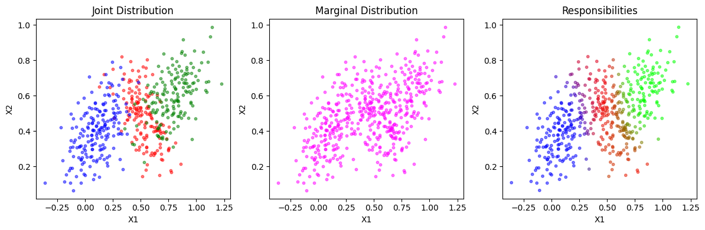

# Gaussian Mixture Models

## Objective
This repository contains an implementation of **Exercise 4** from the *Pattern Recognition and Machine Learning* textbook. The goal of the exercise is to visualize the behaviour of a **3-component, 2D Gaussian Mixture Model (GMM)** using the following parameters for each Gaussian component:

- **Component 1**: 
  - Mean: \(\mu_1 = (0.5, 0.5)\)
  - Covariance: \(\Sigma_1 = \begin{bmatrix} 0.02 & -0.01 \\ -0.01 & 0.02 \end{bmatrix}\)
  
- **Component 2**: 
  - Mean: \(\mu_2 = (0.8, 0.6)\)
  - Covariance: \(\Sigma_2 = \begin{bmatrix} 0.02 & 0.01 \\ 0.01 & 0.02 \end{bmatrix}\)
  
- **Component 3**: 
  - Mean: \(\mu_3 = (0.1, 0.4)\)
  - Covariance: \(\Sigma_3 = \begin{bmatrix} 0.02 & 0.01 \\ 0.01 & 0.02 \end{bmatrix}\)

The exercise includes generating samples from the GMM, and visualizing them in a 3-panel plot that shows:
1. **Joint Distribution** of the GMM samples.
2. **Marginal Distribution** of the samples.
3. **Responsibilities** of each Gaussian component in explaining each sample.

## Files in this Repository

- **gmm_visualization.py**: Contains the implementation of the Gaussian Mixture Model sampling, visualization, and plotting.
- **README.md**: This file provides an overview of the exercise and repository.

## Conclusion
The code successfully implements the task to visualize a 3-component 2D Gaussian Mixture Model, with appropriate visualization techniques to display how each component contributes to the overall mixture. The plot allows for a qualitative analysis of the GMM's behavior and the responsibilities of each component in explaining the data.
